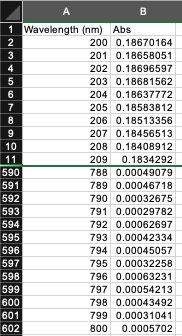
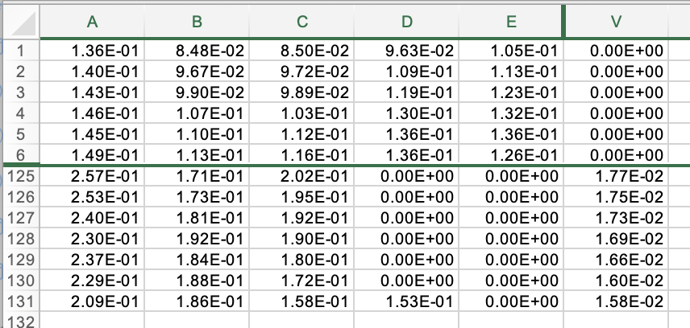
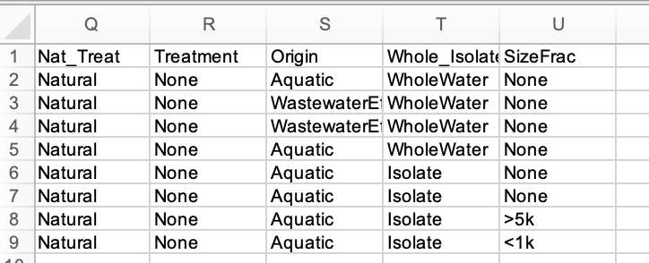
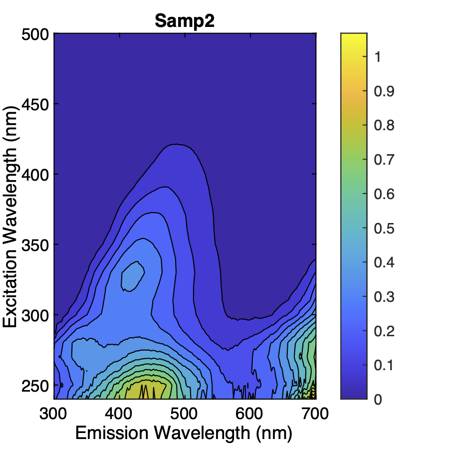
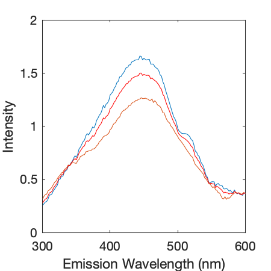

# DOM-OS-Calc
This is a repository for MATLAB Code that applies quality control criteria and calculates optical surrogates (OS) from absorbance and fluorescence data of dissolved organic matter (DOM).

## Reference
This project was a collaboration between Julie Korak at the University of Colorado Boulder and Garrett McKay at Texas A&M University. This code was released as a supplement to the following paper:

Korak, J.A., McKay G. "Meta-Analysis of Optical Surrogates for the Characterization of Dissolved Organic Matter". Environmental Science and Technology (2024)

For attribution, please cite the original paper.

<br>

# License
This code is licensed under a [GPL 3.0 license](README.md). Please cite the original [paper](<#reference>) for attribution.

<br>

# Contents

* MATLAB CODES: MATLAB source code directory. This folder contains the functions that calculate optical surrogates with or without screening for quality control
* Input Files: Folder containing a blank template for the input file and an [example input file](<Input Files/Input_Example.txt>) for the example data. See [below](<#set-up-the-input-file>) for details
* ExampleData: Folder with two subfolders containing example absorbance and fluorescence data.
* Output: Folder to where source code saves consolidated outputs (.txt and .mat)
* Images: Images used in supporting documentation

<br>

# Instructions

## Confirm file contents and formats
The DOM-OP-Calc toolbox assumes that  the data for each sample are in unique files (one file per sample). 

**Absorbance files:** One  .csv file per sample. The first column has wavelengths in ascending order (small to big). The second column has measured absorbance. The file has headers with data starting on the second row.



**Fluorescence files:** One .xls file per sample. The code expects that the matrix contains corrected fluorescence intensities. Please see Murphy et al. (2010) for standard procedures to correct fluorescence data (https://doi.org/10.1021/es102362t). Each row corresponds to an emission wavelength ordered in ascending order. Each column corresponds to an excitation wavelength. Excitation wavelengths can be ordered in ascending or descending order, which is specified in the input file using the *Flipped* column. 



## Organize Files
The released code expects a two level folder structure for organizing optical data relative to the directory path where the MATLAB code, input, and output folders are located.

```
├── TopFolder1
│   ├── Subfolder1
│   ├── Subfolder2
│   ├── Subfolder3
├── TopFolder2
│   ├── Subfolder1
│   ├── Subfolder2
│   ├── Subfolder3
...
├── MATLAB CODES
├── Input Files
├── Output
```

**Note:** Confirm the following folders are created and named exactly as shown. 
```
├── MATLAB CODES
├── Input Files
├── Output
```
Folders containing the optical data can have custom names as appropriate for the project (e.g., TopFolder1 --> DW_Project).

## Set up the input file
A .txt file is the input that matches the sample names, instrument settings, and dissolved organic carbon concentration for each sample. Editing in a spreadsheet software is recommended then saving the final version as a .txt. The headers in columns A-P may not be changed. Columns Q-U are customizable for user-defined metadata associated with each sample.


Descriptions for Columns A-P are as follows:


* **TopFolder:** String with name of folder in the same directory level as MATLAB CODES folder
* **SubFolder:** String with name of subfolder within the corresponding TopFolder
* **Abs_Name:** String with name of .csv absorbance file
* **Wave_min:** Scalar for starting wavelength of absorbance spectra
* **Wave_max:** Scalar for ending wavelength of absorbance spectra
* **Wave_inc:** Scalar for wavelength increment of absorbance spectra
* **Pathlength:** Scalar for the absorbance cuvette pathlength in units of cm
* **Fluor_Name:** String with name of .xls fluorescence file
* **Flipped:** Y or N designating if the excitation wavelengths (corresponding to columns) are in ascending order (N) or descending order (Y)
* **Ex_min:** Scalar for starting wavelength of fluorescence excitation vector
* **Ex_max:** Scalar for ending wavelength of fluorescence excitation vector
* **Ex_inc:** Scalar for wavelength increment of fluorescence excitation vector
* **Em_min:** Scalar for starting wavelength of fluorescence emission vector
* **Em_max:** Scalar for ending wavelength of fluorescence emission vector
* **Em_inc:** Scalar for wavelength increment of fluorescence emission vector
* **DOC:** Scalar for dissolved organic carbon (DOC) concentration in units of mgC/L. Enter NaN if unknown.

Columns Q-U can be customized with user-defined metadata. *Strings without spaces are required.* An example corresponding to the original publication is shown below.




Enter NaN in all cells if the field is unused.

## Set Calculation Preferences

Enter the QC thresholds for each optical surrogate in the [Data_Process.m](<MATLAB CODES/Data_Process.m>) file. Definitions of each QC criteria are defined in the Suporting Information for [Korak and McKay (2024)](<#reference>). 

**Users are responsible for assessing appropriate QC thresholds for their instrument, method, and sample context and updating these thresholds as appropriate.**

If QC criteria will not be applied to optical surrogates, then the mininum absorbance threshold is zero and all other surrogates are set to large numbers.

```
if QC_flag==1
    QC.Abs=0.005; %Minimum absorbance threshold
    QC.HIX=0.04;  %Maximum RSMD 
    QC.BIX=0.008;
    QC.FI=0.009;
    QC.PkA=0.02;
    QC.PkB=0.16;
    QC.PkC=0.008;
    QC.PkT=0.02;
else
    %Set all fluorescence to very large, unrealistic numbers. Set Abs to
    %zero
    QC.Abs=0;
    QC.HIX=1e6;
    QC.BIX=1e6;
    QC.FI=1e6;
    QC.PkA=1e6;
    QC.PkB=1e6;
    QC.PkC=1e6;
    QC.PkT=1e6;
end
```


## Run 
Set the Current Directory in MATLAB to the MATLAB CODES folder.

```
..../MATLAB CODES
```

Call the [Data_Process](<MATLAB CODES/Data_Process.m>) function, which takes five input arguements. More information is provided in the function header. 

```
Data_Process(NameList,Rows,plot_flag,QC_flag,Out_perc)
```

For the example dataset, call
```
Data_Process('Input_Example',1:8,1,1,0)
```


## Outputs

While the code is executing, the following images will be generated if Plot_flag function input as enabled (1).

1. EEM with 2nd order Rayleigh and Raman scatter interpolated. This file is saved in the same folder as the sample data in a subfolder called EEM_Images.




2. A plot showing the interpolated emission spectra for Ex = 254 nm to calculate HIX for visual inspection of reasonable interpolation. 




3. A .xls file with interpolated EEM. Matrix orientation is rows are emission wavelengths in ascending order, and columns are excitation wavelengths in ascending order. 

For all executions, the following files are saved:

1. Summary table (.txt) is saved combining the input information, optical surrogates, and QC metric measured for each sample. A [key for the sample headings](<MATLAB CODES/Output_Format_ReadMe.txt>) is provided.


2. Summary data structure (.mat) containing the same information as the summary table.


[def]: Images/Samp_EEM.png
